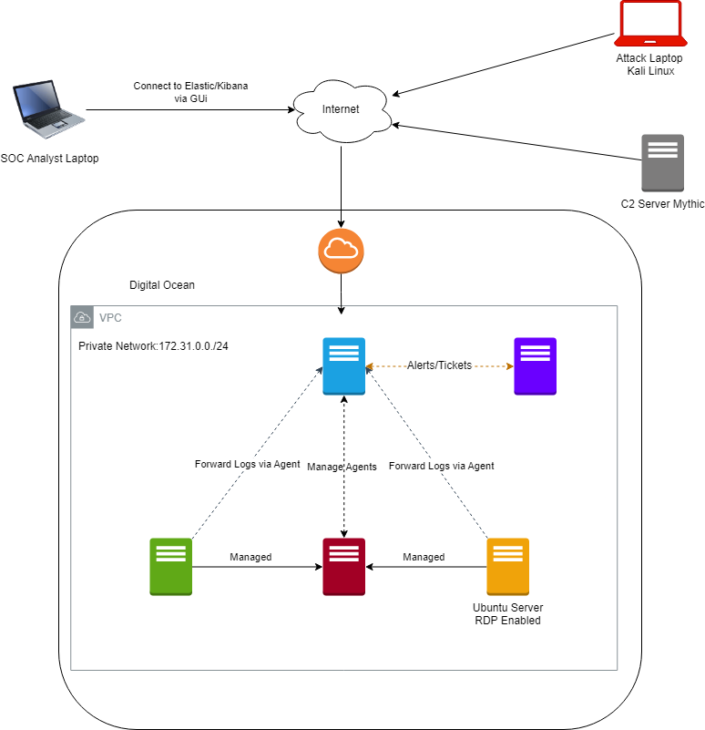

# Day 1: How to Create a Logical Diagram

The first day of the **30-Day MYDFIR SOC Analyst Challenge** focuses on the critical architectural phase: **How to Create a Logical Diagram**. Before deploying a single server or writing a single line of code, it is essential to visualize the entire infrastructure to understand how data will flow from the endpoints to the monitoring tools.

### **Objective**

The primary goal of this stage is to design a visual representation of the SOC lab. This diagram serves as a roadmap for the next 29 days, ensuring that every component—from the "victim" machines to the SIEM—is properly integrated and accounted for.

### **Core Components of the Lab Architecture**

Based on the challenge curriculum, the logical diagram must account for the following key entities that will be built in subsequent days:

- **The SIEM Stack:** The central brain of the operation, consisting of **Elasticsearch** for data storage and **Kibana** for visualization and alerting.
- **Endpoints (Telemetry Sources):**
    - A **Windows Server 2022** instance, which will serve as a primary source of endpoint logs.
    - An **Ubuntu Server 24.02** instance to provide a Linux-based perspective for cross-platform monitoring.
- **Data Collection Agents:** The **Elastic Agent** and **Fleet Server**, which are responsible for shipping logs from the servers to the SIEM.
- **Adversary Emulation:** The **Mythic C2 framework**, used to simulate real-world attacks like command-and-control activity.
- **Incident Management:** A dedicated **ticketing system (osTicket)** to document and track investigations.

### **Visualizing Data Flow**

A key takeaway from Day 1 is understanding the **ingestion pipeline**. The logical diagram should clearly illustrate how telemetry (such as Sysmon logs or SSH attempts) moves from the Windows and Linux endpoints through the Elastic Agent and into the Elasticsearch database before finally appearing on a Kibana dashboard for analysis.

For this, we use [draw.io](http://draw.io) to create logical diagram.

### **Conclusion**

Starting with a logical diagram is a standard best practice for any security professional. It provides clarity for the implementation phase and serves as an invaluable reference during the **troubleshooting** phase at the end of the challenge. By the end of Day 1, you have a complete technical strategy, shifting the focus from "what" to build to "how" to build it.