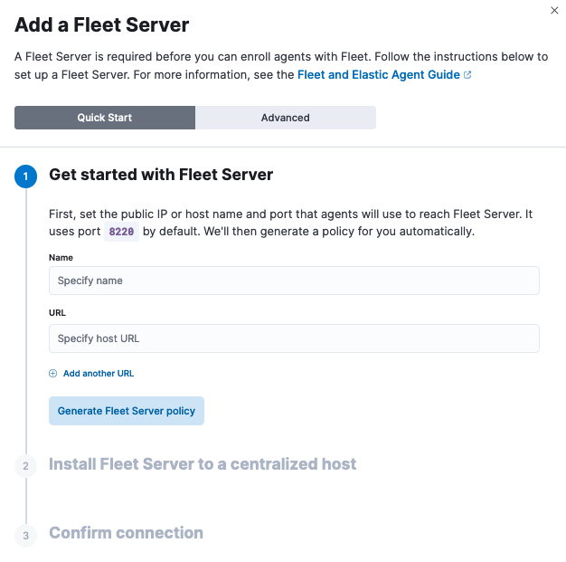

# Day 7: Elastic Agent and Fleet Server Setup

Following the conceptual introduction on Day 6, Day 7 focuses on the **Elastic Agent and Fleet Server Setup Tutorial**. This is the phase where we transition from having isolated servers to a fully connected monitoring ecosystem.

**Objective**

The primary goal of Day 7 is to move from theory to execution by establishing a functional communication channel between the **Windows Server 2022** "victim" machine and our **ELK stack**.

**Technical Implementation**

- **Fleet Server Configuration:** Within the Kibana interface, we initialize the **Fleet Server**. This involves setting up the host URL and generating the necessary service tokens that allow agents to securely check in.
- **Agent Enrollment:** We generate the installation command from the Fleet UI and execute it on the Windows Server. This process "enrolls" the server as a managed host, allowing us to push configurations directly from the SIEM console.
- **Policy Management:** Once enrolled, we apply an initial **agent policy** to the Windows host. This policy dictates what data the agent should collect and where it should send it

**Default port assignments**

When Elasticsearch or Fleet Server are deployed, components communicate over well-defined, pre-allocated ports. You may need to allow access to these ports. Refer to the following table for default port assignments:

| **Component communication** | **Default port** |
| --- | --- |
| Elastic Agent → Fleet Server | 8220 |
| Elastic Agent → Elasticsearch | 9200 |
| Elastic Agent → Logstash | 5044 |
| Elastic Agent → Kibana (Fleet) | 5601 |
| Fleet Server → Kibana (Fleet) | 5601 |
| Fleet Server → Elasticsearch | 9200 |

## Deploy Fleet Server VM

**Vultr Dashboard** → **Compute** → **Deploy New Server**

### Step 1: Server Specs

```bash
Type: Dedicated CPU ✓
Location: Tokyo, Japan ✓
Plan: General Purpose (1 vCPU, 4GB RAM) ✓
⏹️ Disable Auto Backup
```

### Step 2: OS & Network

```bash
OS: Ubuntu 22.04 LTS x86_64 ✓
VPC Network: MyDFIR-SOC-Challenge ✓
Hostname: MyDFIR-Fleet-Server
Public IPv4: Enabled ✓
```

**Deploy Now** → **Note the Public IP** (e.g., `<FLEET_SERVER_IP>`)

---

## Configure Kibana: Add Fleet Server

Open **Kibana**: `http://<ELK_PUBLIC_IP>:5601`

**Fleet** → **Agents** → **Add Fleet Server**

```bash
Name: MYDFIR-Fleet-Server
URL: https://<FLEET_SERVER_IP>:8220
```

**Generate Fleet Server Policy** → **Copy install command**



---

## SSH to Fleet Server + Prepare Firewall

```bash
ssh root@<FLEET_SERVER_IP>
apt update && apt upgrade -y
```

### Allow ELK Communication

**On MyDFIR-ELK VM**:

```bash
ssh root@<ELK_PUBLIC_IP>
ufw allow 9200
ufw status  # Verify rule added
```

**Vultr Firewall** → Add rule:

```bash
TCP | 9200 | Source: <FLEET_SERVER_IP>/32 → MyDFIR-ELK
```

---

## Install Fleet Server

**Back on Fleet Server** → **Paste the Kibana command**:

```bash
curl -L -O https://artifacts.elastic.co/downloads/beats/elastic-agent/elastic-agent-9.3.4-linux-x86_64.tar.gz
tar xzvf elastic-agent-9.3.4-linux-x86_64.tar.gz
cd elastic-agent-9.3.4-linux-x86_64

sudo ./elastic-agent install \
  --fleet-server-es=https://<ELK_PUBLIC_IP>:9200 \
  --fleet-server-service-token=<TOKEN_REDACTED> \
  --fleet-server-policy=fleet-server-policy \
  --fleet-server-es-ca-trusted-fingerprint=7c6727c58f636d65582b9a1a1f1e79b1d8d6a6b04a3c7a99d4acda62b5049735 \
  --fleet-server-port=8220 \
  --install-servers
```

```bash
Elastic Agent has been successfully installed.
```

---

## Create Windows Agent Policy

**Kibana** → **Fleet** → **Agent Policies** → **Create Agent Policy**

```bash
Name: MyDFIR-Windows Policy
Default Namespace: default
```

**Kibana** → **Fleet** → **Agents** → **Continue enrolling Elastic Agent**

---

## Install Elastic Agent on Windows

**On MyDFIR-WIN-100** → **PowerShell as Administrator**:

```bash
$ProgressPreference = 'SilentlyContinue'
Invoke-WebRequest -Uri https://artifacts.elastic.co/downloads/beats/elastic-agent/elastic-agent-9.3.4-windows-x86_64.zip -OutFile elastic-agent-9.3.4-windows-x86_64.zip 
Expand-Archive .\elastic-agent-9.3.4-windows-x86_64.zip -DestinationPath .
cd elastic-agent-9.3.4-windows-x86_64
.\elastic-agent.exe install --url=https://167.179.66.250:443 --enrollment-token=<TOKEN_REDACTED>
```

**First attempt fails** (wrong port):

```bash
.\elastic-agent.exe install --url=https://167.179.66.250:443 --enrollment-token=UmNTYThwMEJ2bFV1aFFWaUhtWWE6NHpTeWhVU0NmUHRzR1JTTEpNS1ZYQQ==
```

<aside>
⚠️

*Error*: `fail to execute request to fleet server`

</aside>

---

## Fix Fleet Settings + Firewall

### Update Kibana Fleet Settings

**Kibana** → **Fleet** → **Settings** → Change **port 443 → 8220**


### Allow Fleet Server Port

**On MyDFIR-Fleet-Server**:

```bash
root@MyDFIR-ELK# ufw allow 9200
Rules updated
Rules updated (v6)
```

**Vultr Firewall** → Add:

```powershell
TCP | 8220 | Source: <WINDOWS_PUBLIC_IP>/32 → MyDFIR-Fleet-Server
```

---

## Windows Agent Install

**PowerShell** (copy fresh token from Kibana):

```powershell
.\elastic-agent.exe install \
  --url=https://167.179.66.250:8220 \
  --enrollment-token=<NEW_TOKEN> \
  --insecure --force
  
Successfully enrolled the Elastic Agent.
[    ] Done  [16s]
Elastic Agent has been successfully installed.
```

---

## Verify Everything Works

**Kibana** → **Fleet** → **Agents**:

```bash
✅ MYDFIR-Fleet-Server (Healthy)
✅ MyDFIR-WIN-100 (Healthy) ##Guest (hostname not recognized)
```


---

### **Reference**: [Elastic Fleet Docs](https://www.elastic.co/docs/reference/fleet/install-fleet-managed-elastic-agent)