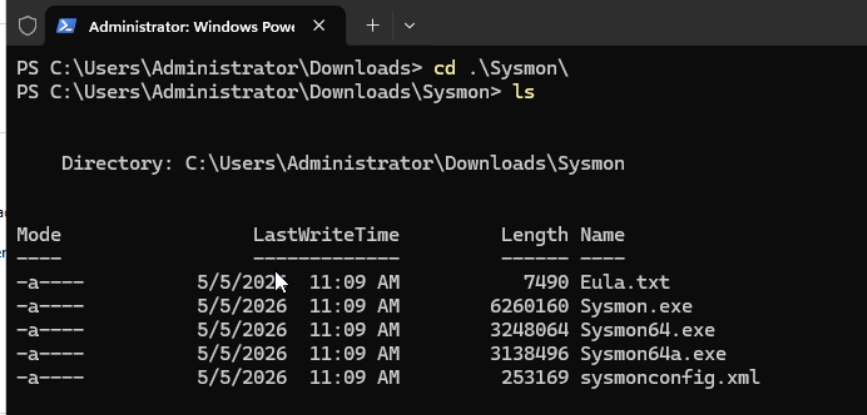

# Day 9: Sysmon Setup

### **Objective**

The primary goal today is to install and configure **System Monitor (Sysmon)** on the **Windows Server 2022** instance created on Day 5. While the Windows host was connected to our SIEM via the Elastic Agent on Day 7, it is currently only sending standard event logs. Installing Sysmon provides the "high-fidelity" data necessary for advanced threat hunting.

### **Technical Implementation**

- **Installation:** The Sysmon utility is deployed as a system service on the Windows endpoint.
- **Configuration:** A configuration file is typically used during setup to define which events should be captured (such as process creation, network connections, or file integrity changes) and which should be filtered out to reduce noise.
- **Verification:** Once installed, the analyst must ensure that Sysmon is successfully generating events within the Windows Event Viewer (specifically under `Applications and Services Logs/Microsoft/Windows/Sysmon/Operational`).

### **Why This Matters for the SOC Lab**

As an aspiring SOC analyst, Day 9 is where we transition from basic monitoring to **adversary-focused telemetry collection**. By setting up Sysmon, we are ensuring that the SIEM will eventually have access to:

- **Command Line Arguments:** Seeing exactly what an attacker typed into a terminal.
- **Parent-Child Process Relationships:** Identifying if a suspicious process (like a C2 agent) was spawned by a common application like PowerShell or Word.
- **Network Activity:** Mapping network connections back to the specific process that initiated them.

### Step 1: Download Sysmon

1. Open a browser on the Windows Server and navigate to:
    
    [https://learn.microsoft.com/en-us/sysinternals/downloads/sysmon](https://learn.microsoft.com/en-us/sysinternals/downloads/sysmon)
    
2. Click **“Download Sysmon”** and save the ZIP file to a folder such as `C:\Users\Administrator\Downloads\Sysmon`.
3. Extract all files from the ZIP archive into the same folder (e.g., `C:\Users\Administrator\Downloads\Sysmon`).
4. Confirm that `Sysmon64.exe` (for 64‑bit Windows) is present in the folder.

### Step 2: Download and save the Sysmon configuration

1. Open a browser and go to: https://github.com/olafhartong/sysmon-modular/blob/master/sysmonconfig.xml
2. Click the **“Raw”** button to view the raw XML content.
3. In the browser, choose **File → Save As** (or equivalent) and save the file as:
    
    ```powershell
    C:\Users\Administrator\Downloads\Sysmon\sysmonconfig.xml
    ```
    
    
    

This gives you the official modular configuration file in the same directory as `Sysmon64.exe`.

### Step 3: Install Sysmon with the configuration

1. Open **PowerShell as Administrator**.
2. Navigate to the Sysmon folder:
    
    ```powershell
    cd "C:\Users\Administrator\Downloads\Sysmon"
    ```
    
3. Run the installation command:
    
    ```powershell
    PS C:\Users\Administrator\Downloads\Sysmon> .\Sysmon64.exe -i sysmonconfig.xml
    ```
    

### Step 4: Verify installation in Services and Event Logs

After installation completes:

- **Services**
    
    Open **Services** (`services.msc`) and look for the **Sysmon** or **Sysmon64** service. It should be listed and running.
    
- **Event Logs**
    
    Open **Event Viewer** and navigate to:
    
    ```powershell
    Applications and Services Logs → Microsoft → Windows → Sysmon → Operational
    ```
    
    Sysmon‑related events are present (e.g., Event ID 11 for file creation) once the system generates activity.
    
    